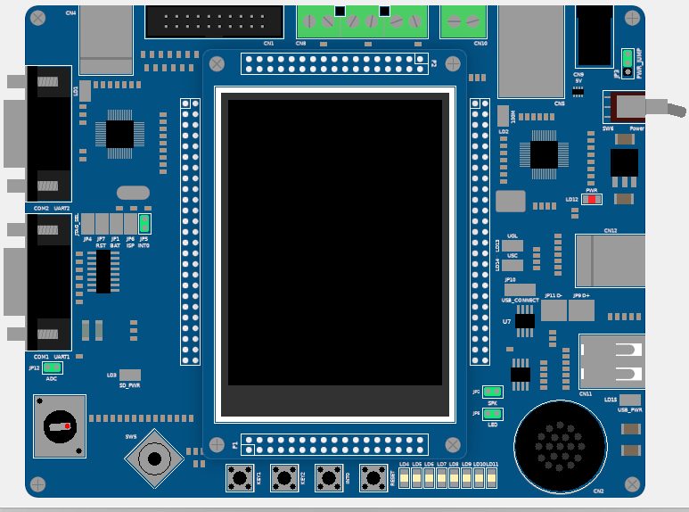

# LandTiger LPC1768 board on Keil

    

This is a project involving the embedded board LPC1768 and permits to interface with it 
through a series of libraries including LEDs, BUTTONs, JOYSTICK and the ADC.  
Note: the project uses polling through the Repetitive Interrupt Timer instead of direct interrupts because the Joystick pins can't throw interrupts. A version which starts the RIT in the button handlers can be implemented if the joystick isn't needed.

## main folder
- **sample.c**: contains the main of the entire project, where all the components are initialized
- **sample.h**: defines some constants to share in the entire project
- **ASM_funct.s**: permits to define ASM functions to use in the project and called following the ABI standard

## led
- **funct_led.c**: it defines some functions regarding the LEDs such as the LED_out() which lights up certain LEDs
- **lib_led.c**: it initializes the LEDs setting up their PIN mode and direction (in/out)

## button_EINT
- **IRQ_button.c**: defines the interrupt handlers of the three buttons INT0, KEY1 and KEY2 of the board (in this version the handlers don't start the RIT but they just set a flag variable that is used later in the RIT handler)
- **lib_button.c**: it setup the pin mode of the buttons and the priority of each of them

## RIT
- **IRQ_RIT.c**: every 50ms the RIT handler is executed. It checks if any of the input pin changed status starting from the joystick (passing through each direction including the composed ones) and ending with the buttons
- **lib_RIT.c**: defines some function that help enabling, starting and reset the RIT

## joystick
Since the handlers aren't needed, in this part of the project we just setup the mode and directions of the 4 pin of the joystick.

# timer
- **IRQ_timer.c**: it defines the interrupt handlers of the 4 timers available (each of them working at 25Mhz). Timers can count up to 0xFFFFFFFF and use up to 4 match register
- **lib_timer.c**: some functions that setup quickly the timers parameters are needed, such as the *count interval* and the *timer behaviour*. This last one is configured easily thanks to the Configuration Wizard

# ADC
In the LPC1768, the ADC samples the value of the potentiometer that can be used for various purposes such has generating random numbers (the sample is used as a seed of the *rand()* function of the C library *stdlib.h*). 
- **lib_adc.c**: it defines the function that starts the conversion of the ADC
- **IRQ_adc.c**: it defines the handler of the ADC that saves the sample value in the unsiged short variable *AD_current*
